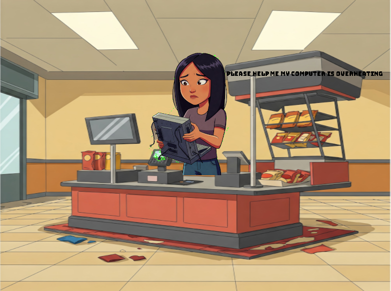
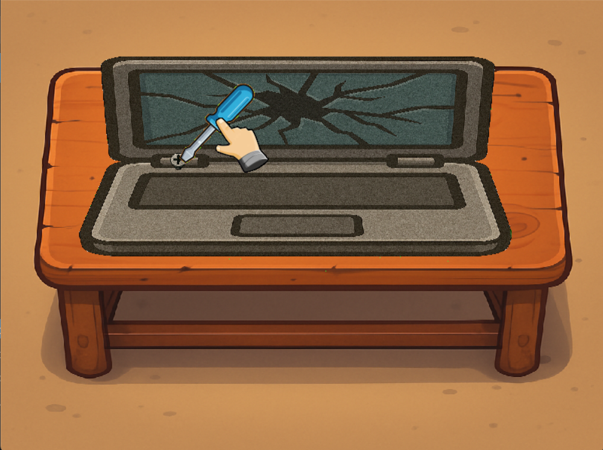

# Repair Rush - A Tech Repair  Game

**Repair Rush** is a fast-paced inspired by *Overcooked*, but instead of cooking meals, you're racing against the clock to fix broken computers in a chaotic repair shop. Designed as a video game development project using **SDL2**.

---

## Features

- Computer repair mini-tasks (e.g., fixing RAM, cleaning fans, reinstalling OS)
- Randomly generated customer orders with increasing difficulty
- Time-based scoring system and star ratings per level
- Built with **SDL2**, **SDL_ttf**, and **SDL_mixer**

---

## Tech 

- **C++**
- **SDL2**: Core graphics and input handling
- **SDL_ttf**: Font rendering for UI and game text
- **SDL_mixer**: Audio support for background music and SFX

---

## Installation & Setup

1. Clone the repository:
   ```bash
   git clone https://github.com/yourusername/CSCI345.git
   cd CSCI345\Repair_Rush\
   ```

2. Make sure you have SDL2, SDL_ttf, and SDL_mixer installed. On Ubuntu:
   ```bash
   sudo apt install libsdl2-dev libsdl2-ttf-dev libsdl2-mixer-dev libsdl2-image-dev
   ```

3. Compile and run the game:
   ```bash
   make run # or use CMake if that's your build system
   ```
4. Delete the executable:
   ```bash
   make clean  # or use CMake if that's your build system
   ```
---


# Installation & Setup MSYS2

## Setting Up MSYS2

1. **Install MSYS2**  
   Download and install MSYS2 from [https://www.msys2.org](https://www.msys2.org).

2. **Update Packages**

   Open the **MSYS2 MSYS** terminal and run:

   ```bash
   pacman -Syu
   ```
   ```bash
   pacman -Su
   ```
   ```bash
   pacman -S base-devel mingw-w64-ucrt-x86_64-toolchain git
   ```
   ```bash
   pacman -S mingw-w64-ucrt-x86_64-SDL2
   pacman -S mingw-w64-ucrt-x86_64-SDL2_image \
              mingw-w64-ucrt-x86_64-SDL2_mixer \
              mingw-w64-ucrt-x86_64-SDL2_ttf
   ```
4. Clone the repository:
   ```bash
   git clone https://github.com/yourusername/CSCI345.git
   cd CSCI345\Repair_Rush\
   ```
   
5. Compile and run the game:
   ```bash
   make run # or use CMake if that's your build system
   ```
6. Delete the executable:
   ```bash
   Make clean  # or use CMake if that's your build system
   ```
7. To get MSYS2 Shell in VSCode:
   Use this video [https://www.youtube.com](https://youtu.be/31tCOg8-foM).
   or in the bash run to desired path
   ```bash
   cd /c/Users/<path to git repo>
   ```
---

## Art & Sound

- Art and music assets are sourced from free-to-use websites and AI including Chatgpt and Google Gemini. (Consider crediting artists here if applicable.)
- “Green Meadows”. Music by Marcelo Fernandez (http://www.marcelofernandezmusic.com). Licensed under Creative Commons Attribution 4.0 International (http://creativecommons.org/licenses/by/4.0/).

---

## How to Play

- **Objective**: Complete as many repair orders as possible within the time limit.
- **Tasks**: Drag and drop parts, troubleshoot components, reboot systems.
- **Controls**:  
  - Movement: Arrow keys / WASD  
  - Action: Spacebar / Enter
  - Switch Screens: R for repair shop C for tool cabinet B for benchtop  
  - Drop Item: Shift

---

## Screenshots

*Loading Screen*  


*Character Select*  


*Client*  


*Tool Cabinet*  


*Mini Game*  


*Mini Game*  


*Mini Game*  


*Control Screen*  


---

## Collaborators
Anthony Chica Carlos Ian Stephen Walker  
