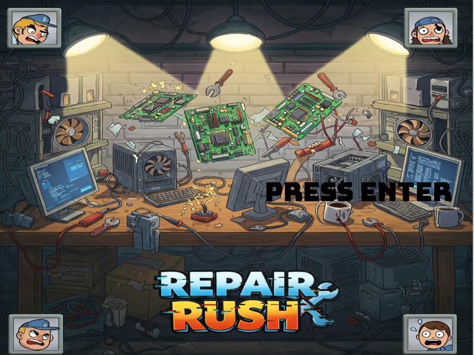

# Repair Rush - A Tech Repair  Game

**Repair Rush** is a fast-paced inspired by *Overcooked*, but instead of cooking meals, you're racing against the clock to fix broken computers in a chaotic repair shop. Designed as a video game development project using **SDL2**.

---

## Features

- Computer repair mini-tasks (e.g., fixing RAM, cleaning fans, reinstalling OS)
- Randomly generated customer orders with increasing difficulty
- Time-based scoring system and star ratings per level
- Built with **SDL2**, **SDL_ttf**, and **SDL_mixer**

---

## Tech 

- **C++**
- **SDL2**: Core graphics and input handling
- **SDL_ttf**: Font rendering for UI and game text
- **SDL_mixer**: Audio support for background music and SFX

---

## Installation & Setup

1. Clone the repository:
   ```bash
   git clone https://github.com/yourusername/RepairRush.git
   cd RepairRush
   ```

2. Make sure you have SDL2, SDL_ttf, and SDL_mixer installed. On Ubuntu:
   ```bash
   sudo apt install libsdl2-dev libsdl2-ttf-dev libsdl2-mixer-dev
   ```

3. Compile and run the game:
   ```bash
   make  # or use CMake if that's your build system
   ```

---

## Art & Sound

- Art and music assets are sourced from free-to-use websites and AI including Chatgpt and Google Gemini. (Consider crediting artists here if applicable.)

---

## How to Play

- **Objective**: Complete as many repair orders as possible within the time limit.
- **Tasks**: Drag and drop parts, troubleshoot components, reboot systems.
- **Controls**:  
  - Movement: Arrow keys / WASD  
  - Action: Spacebar / Enter
  - Switch Screens: R for repair shop C for tool cabinet B for benchtop  
  - Drop Item: Shift

---

## Screenshots

*Loading Screen*  


*Character Select*  


*Client*  


*Tool Cabinet*  


---
